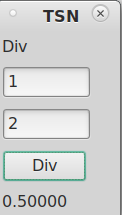
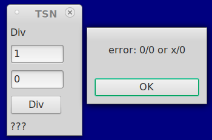
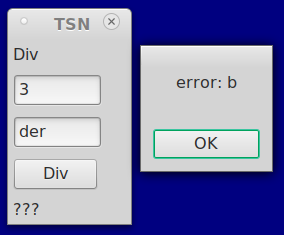
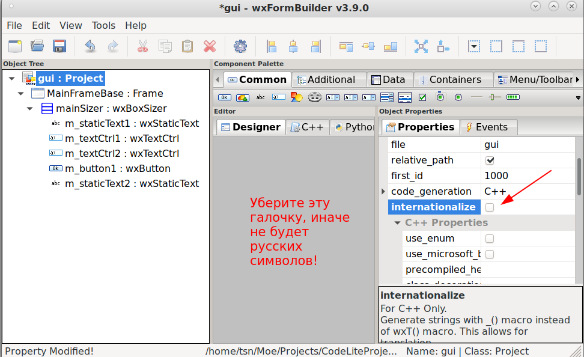
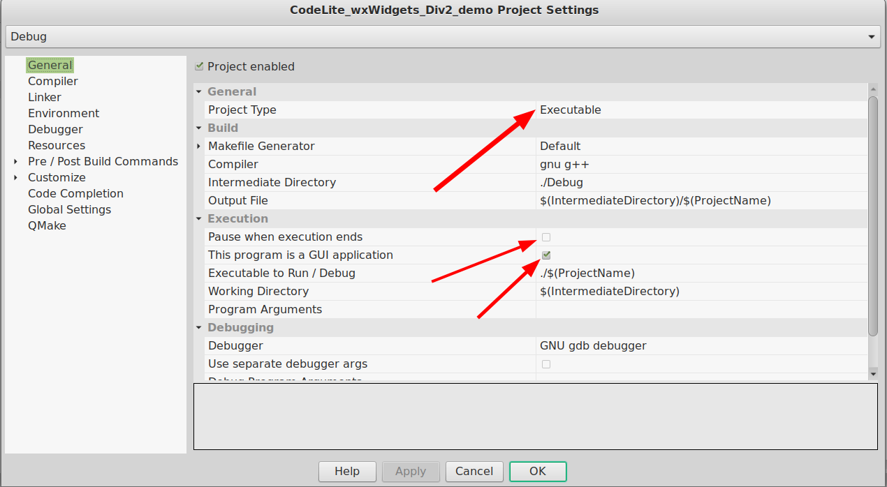

# CodeLite_wxWidgets_Div2_demo
Пример работы с wxWidgets с обработкой ошибок на C++ в CodeLite (linux, debian)











```

class MainFrame : public MainFrameBase
{
public:
    MainFrame(wxWindow* parent);
    virtual ~MainFrame();

protected:
    // protected event handlers
    virtual void OnCloseFrame(
        wxCloseEvent& event); // Копируем сюда из gui.h те методы, которые хотим реально реализовать
    virtual void myClick(wxCommandEvent& event); // иначе все обявленные методы в gui.h останутся "пустыми"
};
```


```
// ЭТО РЕАЛИЗАЦИЯ НАШЕГО МЕТОДА!
void MainFrame::myClick(wxCommandEvent& event)
{
    try {
	double a, b, c;
	if(!m_textCtrl1->GetValue().ToDouble(&a))
	    throw std::logic_error("error: a");
	if(!m_textCtrl2->GetValue().ToDouble(&b))
	    throw std::logic_error("error: b");
	c = a / b;
	if(isnan(c) || isinf(c)) {
	    throw std::logic_error("error: 0/0 or x/0");
	}
	m_staticText2->SetLabel(wxString::Format("%.5f", c));
    } catch(std::exception& e) {
	m_staticText2->SetLabel("???");
	wxMessageBox(e.what());
    }
}

```
